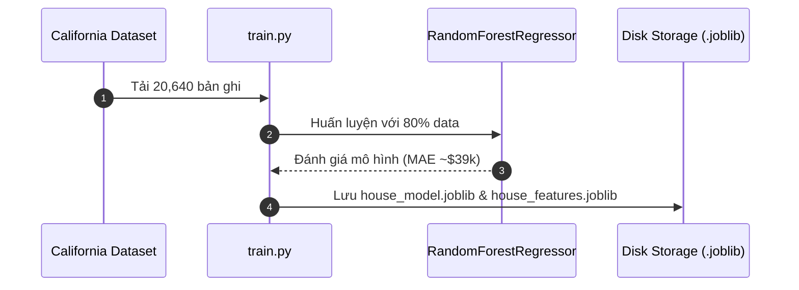
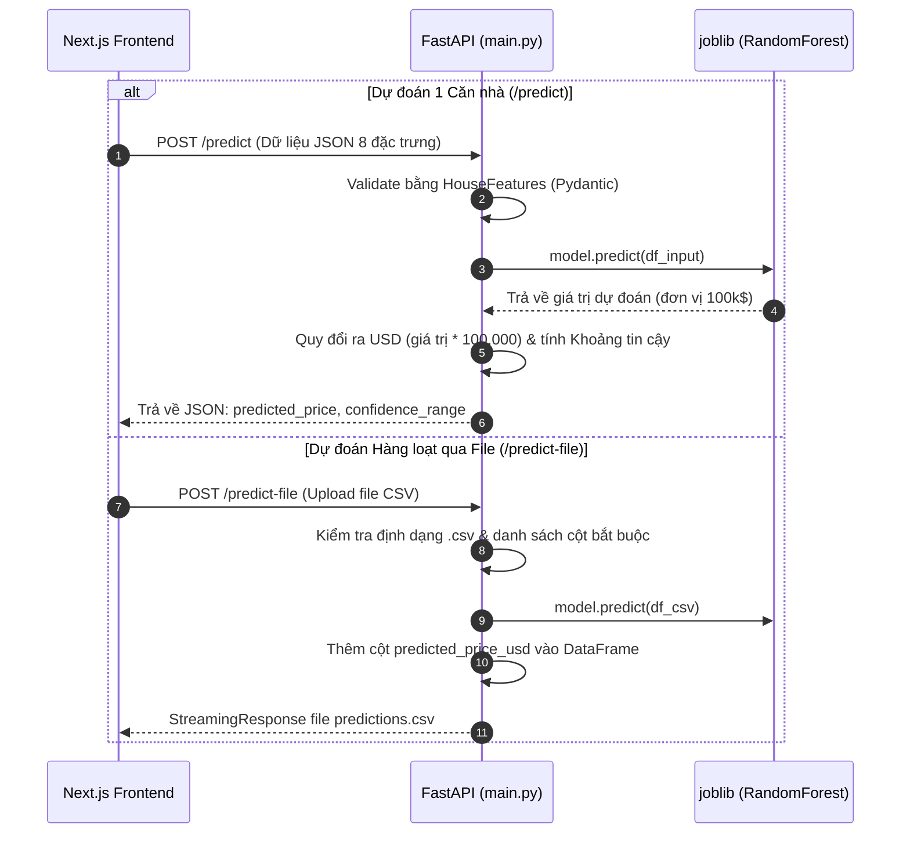

1. House predict (fastapi, nextjs)


# 🏡 Hướng Dẫn Quy Trình Hoạt Động (Workflow Guide)
## California House Price Prediction (FastAPI + Next.js ML Pipeline)

Tài liệu này giải thích chi tiết **luồng hoạt động (Workflow)** của toàn bộ hệ thống dự đoán giá nhà California, từ bước huấn luyện mô hình Machine Learning, đóng gói REST API bằng FastAPI, cho đến giao diện người dùng Next.js.

---

---

## 2. 🔄 Chi Tiết Luồng Hoạt Động (Detailed Workflow Steps)

### Bước 1: Huấn Luyện & Đóng Gói Mô Hình (`train.py`)

1. **Tải Dữ Liệu**: `fetch_california_housing()` từ thư viện `sklearn.datasets`.
2. **Phân Chia Dữ Liệu**: Chia tập dữ liệu thành `X_train`, `X_test`, `y_train`, `y_test` (80% Train, 20% Test).
3. **Huấn Luyện Mô Hình**: Sử dụng thuật toán `RandomForestRegressor(n_estimators=100, random_state=42)`.
4. **Đánh Giá**: Tính toán các chỉ số Mean Absolute Error (MAE $\approx \$39,000$) và R² Score.
5. **Xuất File**:
   - `house_model.joblib`: File chứa trọng số mô hình Random Forest.
   - `house_features.joblib`: Danh sách 8 tên đặc trưng đầu vào (`MedInc`, `HouseAge`, `AveRooms`, `AveBedrms`, `Population`, `AveOccup`, `Latitude`, `Longitude`).



---

### Bước 2: Dịch Vụ API Backend (`main.py`)

FastAPI đóng vai trò server tiếp nhận yêu cầu từ client, kiểm tra tính hợp lệ dữ liệu bằng **Pydantic**, và đưa dữ liệu qua mô hình đã nạp từ bộ nhớ RAM.



---

### Bước 3: Giao Diện Người Dùng Frontend (`frontend/`)

Ứng dụng Next.js giao tiếp với FastAPI để cung cấp trải nghiệm trực quan:

1. **Single Valuation Tab**:
   - Người dùng kéo slider hoặc nhập số cho các thuộc tính.
   - Chọn nhanh các mẫu nhà (**Presets**): *SF Luxury Heights*, *LA Coastal Villa*, *Suburban Family*, *Rural Valley Farm*.
   - **Bản đồ California (`CaliforniaMap.js`)**: Nhấp trực tiếp trên bản đồ để ghim tọa độ Vĩ độ (`Latitude`) và Kinh độ (`Longitude`).
   - Hiển thị thẻ kết quả animated với đơn giá/phòng và khoảng tin cậy.

2. **Batch CSV Valuation Tab**:
   - Cho phép kéo thả file `.csv` chứa nhiều ngôi nhà.
   - Có sẵn nút bấm **Tải file CSV mẫu** (`sample_california_houses.csv`).
   - Bảng xem trước dữ liệu CSV trước khi thực hiện dự đoán.
   - Tự động tải file `predictions.csv` về máy khi hoàn tất và hiển thị biểu đồ thống kê (Giá TB, Max, Min).

3. **Live Health Check**:
   - Liên tục kiểm tra trạng thái `/health` của FastAPI server ở góc trên màn hình.

---

## 3. 🚀 Các Lệnh Chạy Toàn Bộ Workflow (Quick Start)

### 1️⃣ Khởi tạo Môi trường Virtualenv & Cài gói
```bash
# Di chuyển vào thư mục dự án
cd proj2_FastApi_ML/house_predition_api

# Khởi tạo venv & kích hoạt
python -m venv .venv
.venv\Scripts\Activate.ps1

# Cài đặt các thư viện cần thiết
pip install fastapi uvicorn scikit-learn pandas joblib python-multipart
```

### 2️⃣ Huấn luyện Mô hình (Tùy chọn nếu muốn train lại)
```bash
python train.py
```
*Kết quả:* Tạo ra 2 file `house_model.joblib` và `house_features.joblib`.

### 3️⃣ Khởi chạy FastAPI Backend Server
```bash
uvicorn main:app --reload
```
- API Server: `http://127.0.0.1:8000`
- Swagger Documentation: `http://127.0.0.1:8000/docs`

### 4️⃣ Khởi chạy Next.js Frontend App
Mở một terminal mới:
```bash
cd proj2_FastApi_ML/house_predition_api/frontend

# Cài đặt package (chỉ cần chạy lần đầu)
npm install

# Chạy server phát triển
npm run dev
```
- Frontend Web App: `http://localhost:3000`

---

## 📊 Tóm Tắt Cấu Trúc File Dự Án

| File / Thư mục | Mục đích / Vai trò |
| :--- | :--- |
| **`explore.py`** | Phân tích khám phá dữ liệu (EDA), kiểm tra phân phối & tương quan dữ liệu |
| **`train.py`** | Huấn luyện mô hình Random Forest & xuất file `.joblib` |
| **`house_model.joblib`** | File mô hình đã huấn luyện lưu trên ổ cứng |
| **`house_features.joblib`** | Danh sách tên cột đặc trưng của mô hình |
| **`main.py`** | Server FastAPI xử lý API endpoints (`/predict`, `/predict-file`, `/health`) |
| **`frontend/`** | Dự án Next.js 15 chứa giao diện web (React components, Glassmorphic CSS, Map) |
| **`read.md`** | Hướng dẫn lệnh chạy nhanh trên terminal |
| **`WORKFLOW.md`** | Tài liệu chi tiết sơ đồ & luồng hoạt động hệ thống |
